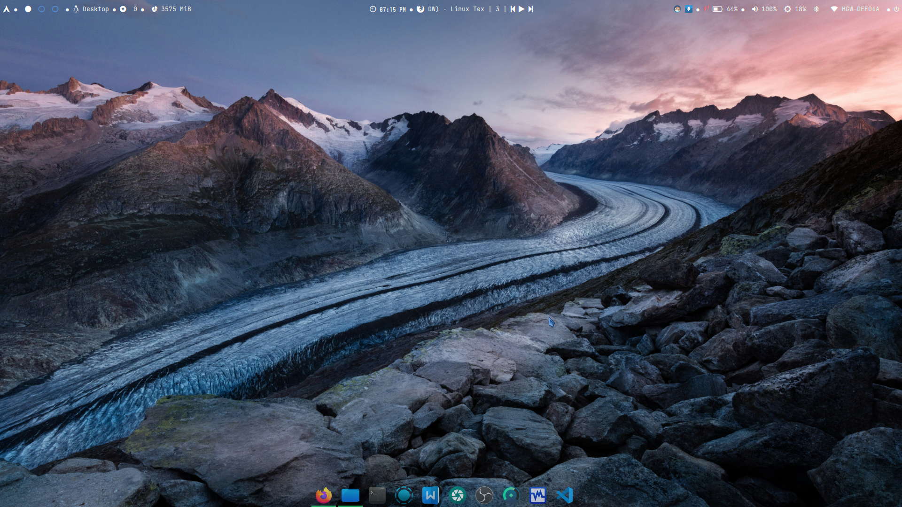

Arch OpenboxWM Refined Setup

Welcome to my personal Arch Openbox Window Manager script for newbies and enthusiasts seeking an ultra aesthetic, functional desktop. This setup is tested on my own hardware – config tweaks and your experience may vary. Use at your own risk; I am not responsible for any issues that may arise. Major thanks to Archcraft Linux for the openboxwm config inspiration!
✨ Features

    Super lightweight, blazing fast

    Minimal, elegant, and highly customizable

    Everything you need for a full desktop experience: productivity, multimedia, ricing, and more

🛠 Required Packages

Install these in one run — they provide essential functionality, visuals, and user experience enhancements:

text
zramswap preload python-dbus xarchiver xed thunar thunar-volman thunar-archive-plugin \
udiskie udisks2 tumbler gvfs xfce4-panel polkit-gnome xfdesktop blueman \
firefox wine winetricks wine-mono wine-gecko seahorse xfce4-settings xfce4-power-manager \
obs-studio virtualbox-guest-utils unzip bc openbox obconf playerctl \
xcompmgr parcellite gst-plugins-bad ttf-wps-fonts localsend numlockx rofi polybar \
lxappearance gst-plugins-base tlp tlp-rdw tlpui visual-studio-code-bin zsh \
zsh-syntax-highlighting zsh-autosuggestions gst-plugins-ugly qbittorrent git wget curl \
zsh-history-substring-search zsh-completions gst-plugins-good wps-office virtualbox \
xfce4-screenshooter xdg-desktop-portal-gtk

Install via:

text
sudo pacman -Syu zramswap preload python-dbus xarchiver xed thunar thunar-volman thunar-archive-plugin \
udiskie udisks2 tumbler gvfs xfce4-panel polkit-gnome xfdesktop blueman \
firefox wine winetricks wine-mono wine-gecko seahorse xfce4-settings xfce4-power-manager \
obs-studio virtualbox-guest-utils unzip bc openbox obconf playerctl \
xcompmgr parcellite gst-plugins-bad ttf-wps-fonts localsend numlockx rofi polybar \
lxappearance gst-plugins-base tlp tlp-rdw tlpui git wget curl qbittorrent \
virtualbox xfce4-screenshooter xdg-desktop-portal-gtk

AUR required for: visual-studio-code-bin, zsh-* packages, wps-office, etc.
Use your favorite AUR helper: yay or paru.
🎨 How to Make It Aesthetic

    Themes: Use obconf and lxappearance to pick your favorite GTK and Openbox themes. Try Arc, Adapta, Numix, or explore [box-look.org].

Icons: Add striking icon packs like Papirus, Numix, Hyprid.

Fonts: Install cool fonts – e.g., ttf-wps-fonts, FiraCode or JetBrains Mono.

Compositor: Enable transparency and shadows with xcompmgr.

Panels & Launchers: Customize polybar and rofi to match your vibe.

Wallpapers: Set high-res, minimal backgrounds. Check out [devianArt] or Unsplash.

    Automate & Tweak: Personalize Openbox keybinds, menus, and autostart for efficient workflows.

🚀 Usage & Tips

    Configure Openbox visually: obconf and lxappearance

    Keybindings: Edit ~/.config/openbox/rc.xml

    Panel: Try polybar or xfce4-panel for persistent system stats & shortcuts

    Hotkeys & Scripts: Automate with shell scripts, manage via autostart

    For launchers & powermenus, play with rofi, playerctl

    System optimizations: zramswap, tlp, etc.

📢 Final Notes

This setup is tested, but configs may change or break. Backup your configs, check the Arch Wiki, and customize to fit your style! Happy ricing!

    “UNIX is simple and coherent”
    —Dennis Ritchie

Major credit: Archcraft Linux and the Arch community for inspiration and resources.

Enjoy your new, super aesthetic Arch OpenboxWM experience!

📢 Credits

    —Archcraft Linux
